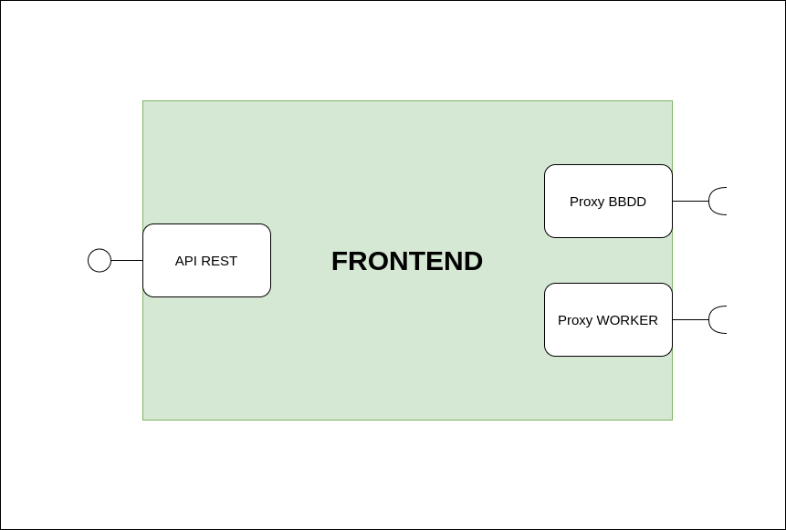
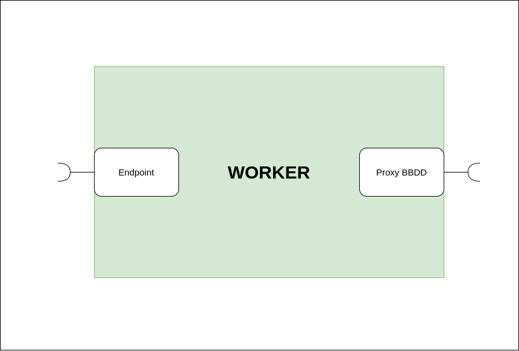
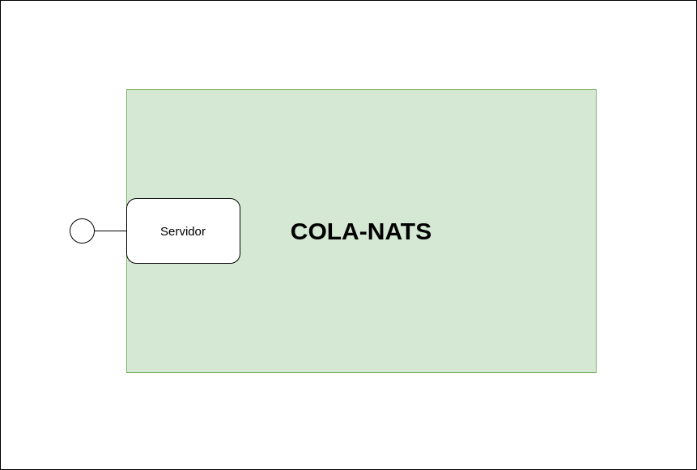
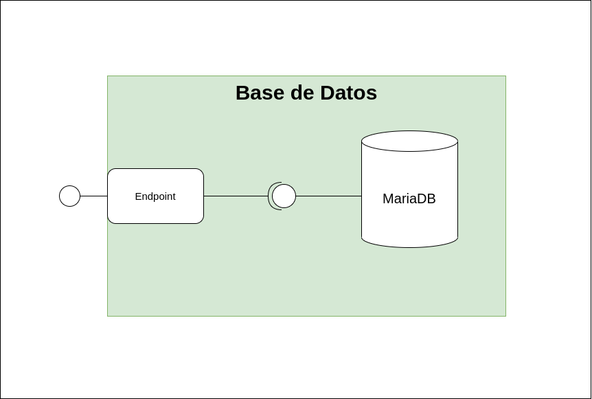

# Proyecto de laboratorio: Push-Pull

<!-- Resumen -->

Este proyecto consiste en el desarrollo y despliegue de un servicio de filtrado de mensajes persistentes. El servicio alberga una arquitectura basada en microservicios, con la finalidad de que el producto final sea altamente escalable y disponible para el despliegue en infraestructuras *Cloud*. Para corroborar esta última característica, se incluyen los manifiestos necesarios para desplegar el servicio en la plataforma [Kumori Paas](https://kumori.systems/).

<!-- Indice -->
## Tabla de contenidos

1. [Descripción](#desc)
2. [Funcionamiento](#func)  
    2.1. [Inserción de objetos JSON - PUSH](#func/uno)  
    2.2. [Querys - PULL](#func/dos)   
    2.3. [Eliminación de objetos - DELETE](#func/tres)   
    2.4. [Instalación y despliegue local](#func/cuatro) 
3. [Microservicios](#micro)  
    3.1. [Frontend](#micro/uno)  
    3.2. [Worker](#micro/dos)  
    3.3. [Cola](#micro/tres)  
    3.4. [Base de datos](#micro/cuatro)
4. Representación del modelo en Kumori Paas


<!-- Descripción -->

## 1. Descripción <a name="desc"></a>

Esta aplicación es un caso práctico y sencillo de la arquitectura básica que ha de estar presente en cualquier aplicación que se quiera llevar a producción en infraestructuras *Cloud*. A su vez, esta arquitectura basada en microservicios permite desarrollar de manera desacoplada los distintos componentes del producto final, ganando así, en independencia, escalabilidad y tolerancia a fallos.

El servicio **Push-Pull** responde a la integración de 4 componentes:

- **FRONTEND**
- **WORKER**
- **COLA**
- **BBDD** (Base de datos)

cuyas funcionalidades son las siguientes:

El microservicio **FRONTEND** expone un servidor API REST desde el cual los clientes serán capaces de:  

1. Insertar objetos JSON (Push).
2. Realizar un límitado número de *querys*, en busca de los objetos previamente insertados en el servicio (Pull).
3. Eliminar objetos del servicio utilizando la misma semántica que las *querys* permiten.

Las peticiones de inserción y eliminación de objetos que reciba el **FRONTEND** se almacenan en una **COLA** persistente de mensajes, desde la cual, el microservicio **WORKER**, cuando esté ocioso, rescatará para llevar a cabo las operaciones oportunas en la **BBDD**. Por otro lado, las peticiones *Pull*, o *querys*, que reciba el **FRONTEND** las resolverá directamente contactando con la **BBDD**.


<!-- Funcionamiento -->

## 2. Funcionamiento <a name="func"></a>

El cliente puede interactuar con el servicio a través del API REST que expone el **FROTEND**. Los métodos y las rutas para poder interactuar con la interfaz son las siguientes:

### 2.1. Inserción de objetos JSON - PUSH <a name="func/uno"></a>

- POST ⮕ "URL/api/propietario/&lt;nombre propietaro&gt;"

### 2.2. Querys - PULL <a name="func/dos"></a>

Extraer todos los objetos almacenados en la base de datos:
- GET ⮕ "URL/api/"

Buscar todos los objetos que posee un propietario en concreto:
- GET ⮕ "URL/api/propietario/&lt;nombre propietaro&gt;"

Buscar todos los objetos que pertenezcan a un propietario y contenga la clave especificada:
- GET ⮕ "URL/api/propietario/&lt;nombre propietaro&gt;/campo/&lt;clave&gt;"

Buscar un objeto por su identificador único (otorgado por la base de datos):
- GET ⮕ "URL/api/&lt;ID&gt;

### 2.3. Eliminación de objetos - DELETE <a name="func/tres"></a>

Borrar todos los objetos insertados en la base de datos:
- DELETE ⮕ "URL/api/"

Borrar todos los objetos que pertenencen a un propietario específico:
- DELETE ⮕ "URL/api/propietario&lt;nombre propietaro&gt;"

Borrar todos los objetos que pertenezcan a un propietario y contenga la clave especificada:
- DELETE ⮕ "URL/api/propietario/&lt;nombre propietaro&gt;/campo/&lt;clave&gt;"

Borrar un objeto por su identificador único (otorgado por la base de datos):
- DELETE ⮕ "URL/api/&lt;ID&gt;

Adicionalmente, la ruta *root* de la URL se ha condicionado para responder con un mensaje predeterminado, de modo que sirve para averiguar el estado del servicio:

```js
router.get('/', (req, res) => {
    const bienvenida = {
        mensaje: 'Bienvenido/a a la API REST de PUSH-PULL. Para empezar a usarla: URL/api/', 
    };
    res.json(bienvenida);
});  
```

Cabe resaltar que esta API REST responde todas las peticiones en formato JSON.

### 2.4. Instalación y despliegue local <a name="func/cuatro"></a>

Si se quisiera instalar y desplegar el servicio en la máquina local, se han de seguir los siguientes pasos:

**Instalación**  
Se ha de disponer de la versión 16 o superior de [Node.js](https://nodejs.org/es/), así como del manejador de paquetes [npm](https://www.npmjs.com/). Después de clonar el repositorio, acceder a la carpeta `code` y ejecutar el siguiente *script* en la terminal:

```bash
for i in frontend worker database
do
    cd ${i}
    npm install
    cd ..
done
```

Este pequeño *script* instalará todas las dependencias de npm, necesarias para ejecutar los microservicios. 

**Despligue**

El repositorio dispone del fichero `docker-compose.yml` con la configuración necesaria como para poder ejecutarlo con la siguiente instrucción:

```
docker-compose up
```
Al ejecutar este comando, asegurarse de que se está en la carpeta donde se encuentra dicho archivo.

```yml
frontend:
    build: code/frontend/.
    environment:
        WORKER_ENDPOINT: natssrv:4222
        DB_ENDPOINT: tcp://database:3001
        HTTP_REST_API_PORT: 3000
    depends_on:
        - natssrv
        - worker
        - database
    ports:
        - "3000:3000"
```

Como se puede observar, por cada uno de los componentes, se contruye la imagen a partir de su [Dockerfile](https://docs.docker.com/engine/reference/builder/), se configura con variables de entorno, se exponen los puertos de servicio, y se establecen las dependencias respecto a otros microservicios.


<!-- Microservicios -->

## 3. Microservicios <a name="micro"></a>

Esta sección pretende describir en profundidad cada uno de los microservicios que componen la apliciación.

### 3.1. Frontend <a name="micro/uno"></a>

Como se ha explicado anteriormente, el **FRONTEND** expone un API REST para que el cliente pueda hacer uso de las opciones que brinda el servicio. Este API está desarrollado haciendo uso de [Express](https://expressjs.com/), que es el framework web más popular de Node.js.



Como se puede ver en la imagen, el **FRONTEND** consta de tres interfaces distintas:

1. API REST es la interfaz de servicio mediante la cual los clientes de internet realizan las peticiones al servicio.
2. Proxy BBDD es el canal por el que establece comunicación con la base de datos, es decir, una dependencia.
3. Proxy WORKER es el otro canal cliente que necesita el **FRONTEND** para ejercer su funcionalidad.

Ambos proxys enmascaran las comunicaciones con el resto de microservicios de los que depende, de modo que, dentro del código, proxy BBDD representa las funcionalidades de la **BBDD** en el **FRONTEND**, y, proxy WORKER representa las funcionalidades del **WORKER**, enmascarando la comunicación real con la **COLA**.


### 3.2. Worker <a name="micro/dos"></a>

El **WORKER** es el microservicio encargado de intermediar las operaciones de inserción y borrado de objetos. El ciclo de vida de una instancia de este servicio consiste en pedir posibles tareas que existan en la **COLA**, y, completar dichas tareas. Al igual que el **FRONTEND** este microservicio es *stateless*, es decir, el estado de la instancia no tiene relevancia de cara al correcto funcionamiento del servicio. Este hecho hace posible la escalabilidad horizontal conforme sea necesario, para afrontar el tráfico entrante.



El **WORKER** consta de dos interfaces cliente o dependencias:

1. Endpoint es la interfaz por la que entran los trabajos que solicitan las instancias del **FRONTEND**. Sin embargo, esta interfaz no es realmente un *endpoint* sino un cliente consumidor de la **COLA**. Subscribiendose al *subject* "trabajos" es capaz de hacer peticiones a la *COLA** en busca de trabajo de forma cíclica. Por esta interfaz también es por donde responde a dichos trabajos, depositando estas respuestas con el mismo identificador que el del trabajo que han resuelto, pero con un *subject* de "respuestas". De este modo, el **FRONTEND** sabe recoger las respuestas correspondientes a sus peticiones desde la interfaz "proxy WORKER", ya que realmente es otro consumidor de la **COLA**.

2. Proxy BBDD es la dependencia con la base de datos. Es exactamente el mismo protocolo de comunicación (y código) que se utiliza en el **FRONTEND**. Las comunicaciones se implementan con la librería de paso de mensajes de [ZeroMQ](https://zeromq.org/).


### 3.3. Cola <a name="micro/tres"></a>

Como cola persistente de mensajes se hace uso del servidor [NATS](https://nats.io/). NATS implementa un sistema de persistencia distribuida de mensajes denominado [JetStream](https://docs.nats.io/using-nats/developer/develop_jetstream). Este sistema permite el desacoplamiento temporal del patrón de mensajería "publicador-subscriptor". Los consumidores, o clientes, de NATS se comunican entre ellos a través de este servidor, como si de un buzón de mensajes se tratara, de manera que no se necesita una comunicación síncrona entre el resto de microservicios. Este paradigma de comunicación da lugar a lo que hoy en día se conoce como FaaS (*Function as a Service*).



Este microservicio presenta una única interfaz. Por medio de esta interfaz, todos los consumidores acceden a NATS para poner o recoger mensajes. En el servicio Push-Pull los consumidores de NATS son el **FRONTEND** y el **WORKER**.


### 3.4. Base de datos <a name="micro/cuatro"></a>

La **BBDD** es un microservicio que se compone dos contenedores [Docker](https://www.docker.com/):

1. Un contenedor ejecutando un programa desarrollado en Node.js que implementa la lógica de las operaciones con el gestor de base de datos. Además presenta el *endpoint*, o punto de acceso a la interacción con la base de datos (Servidor ZeroMQ).

2. El segundo contenedor se corresponde con el gestor de base de datos relacional [MariaDB](https://hub.docker.com/_/mariadb).

Ambos contenedores están diseñados para formar un único componente o microservicio, es decir, que pueden compartir el mismo espacio de nombres de red (*network namespace*), lo que se conoce en el mundo de [Kubernetes](https://kubernetes.io/es/) como *POD*.




Este microservicio se compone de una única interfaz, que es el canal servidor de base de datos.

El almacenamiento de objetos en la base de datos relacional(*pushpull*) consta de una única tabla(*JSON_OBJECT*) que contiene tres columnas:

```sql
CREATE DATABASE pushpull;
USE pushpull;
CREATE TABLE JSON_OBJECT(
	Id MEDIUMINT NOT NULL AUTO_INCREMENT,
      Propietario VARCHAR(15) NOT NULL,
      MyData JSON NOT NULL,
      CHECK (JSON_VALID(MyData)),
      PRIMARY KEY (Id)
);
```

1. "**Id**" es un identificador único autoincremental gestionado automáticamente por la base de datos, que proporciona una forma de acceso única y directa al objeto deseado.
2. "**Propietario**" almacena el nombre del dueño del objeto almacenado.
3. "**MyData**" es el objeto JSON almacenado en la acción "Push".